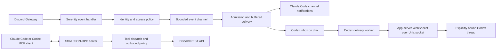

# Dione architecture

Dione is a Rust Discord bridge for Claude Code and Codex. The agent host owns
generative inference and conversation state. Dione owns Discord access policy,
event delivery, and the MCP tools that read or act on Discord.

This map describes the implementation assembled by [main.rs](src/main.rs).
The former design on this page proposed direct Anthropic inference, SQLite,
Qdrant, and local ONNX embeddings. Those are historical proposals, not the
runtime or dependencies in [Cargo.toml](Cargo.toml).

## Processes and transports

The default `dione` mode is `claude-code`. Both modes expose MCP requests and
responses on stdin and stdout. Logs use stderr and an optional log file.
[server.rs](src/mcp/server.rs) implements line-delimited JSON-RPC directly so
responses and channel notifications can share stdout.

In Claude Code mode, accepted events become channel notifications on stdout.
In Codex mode, the notification sink writes events to the local inbox.
[app_server.rs](src/codex/app_server.rs) leases events and sends them to an
explicit thread through a WebSocket over the local app-server Unix socket.
Ordinary delivery starts an idle turn or steers an active turn. Attention-managed
ambient delivery waits for an idle opportunity and does not steer an active turn.

The worker acknowledges an event after the app-server accepts its request.
Acceptance is a transport outcome, not proof that the agent read or acted on the
event. The MCP lease and acknowledgement tools also support explicit pull
consumers. [codex.rs](src/codex.rs) owns consumer identity, leases, thread binding,
and the inbox lock. The [Codex setup guide](README.md#codex-mode) describes binding
and intentional backlog handoff.

The repository contains one package with a library and three executables.
`dione` runs the bridge. [dione-send](src/bin/dione-send.rs) sends once without
the gateway. [gaie_archive](src/bin/gaie_archive.rs) owns archive capture and
replay commands. There is no required Kubernetes or database deployment in
the startup assembly.

## Discord ingress and admission

[client.rs](src/discord/client.rs) builds the Serenity client and requests
gateway intents. [events.rs](src/discord/events.rs) handles messages, edits,
deletions, reactions, interactions, and presence state.

Each message handler loads the current immutable configuration snapshot.
[gate.rs](src/gate.rs) applies DM policy, configured channels, allowlists,
identity ignores, and targeting rules. Unknown DM senders can enter the bounded
[access request queue](src/queue.rs) for admin review. Guild mutes suppress
delivery through the [mute store](src/mute_store.rs).

Webhook identity follows a separate path. The
[runtime verifier](src/discord/verified_action_runtime.rs) observes the webhook
creator and resolves supported PluralKit identity before the
[verified-action gate](src/discord/verified_action.rs) admits an action.
Display names and webhook payload IDs alone are not user authority.
[principal_policy.rs](src/principal_policy.rs) holds the typed principal policy.
The [ingress ledger](src/ingress_ledger.rs) retains admitted lifecycle evidence
for edits, deletes, reply context, and subsequent reads.

Admitted events enter a Tokio channel with capacity 256. The notification task
in [server.rs](src/mcp/server.rs) applies rate limits and optional attention
evaluation, then buffers and coalesces ordinary delivery through
[delivery_buffer.rs](src/delivery_buffer.rs) and [coalesce.rs](src/coalesce.rs).
[batch.rs](src/batch.rs) defines batch formatting. The buffer is in memory;
entering the gateway channel is not a durable inbox commit.

[Attention](src/attention/mod.rs) adds optional recipient-local ambient
admission. Its runtime owns source validation, evaluation, learned-policy
receipts, and transport outcome records. It is disabled by default. The
[attention guide](docs/attention.md) describes modes and promotion requirements.
[Bell evaluation](src/bell_rings.rs) can attach memory recall metadata from
configured MCP providers in shadow or live mode.

## Tools and outbound actions

[protocol.rs](src/mcp/protocol.rs) defines MCP discovery and tool schemas.
[dispatch.rs](src/mcp/dispatch.rs) loads a fresh configuration snapshot for a
tool call and routes it to [tool handlers](src/mcp/tools).
The current request loop awaits each handler before reading the next request.
A slow handler can therefore delay later requests and cancellation handling.

[Messaging handlers](src/mcp/tools/messaging.rs) perform destination access
checks and use Serenity HTTP for Discord operations. File uploads pass the
canonical-path guard in [gate.rs](src/gate.rs), which excludes the state
directory except its attachment inbox. Fetch and download operations also
have their own access checks; an MCP connection is not unrestricted Discord
access.

[pre_send.rs](src/pre_send.rs) installs the production hook pipeline in Observe
mode. Observe records findings without changing or stopping output. Separately,
the [no_rly consent gate](src/no_rly/consent.rs) can hold rejected message text
for an explicit release or rephrase. Its pending handles are in memory, while
resolved outcomes go to the journal. These are different mechanisms.

[permissions.rs](src/permissions.rs) relays Claude Code permission requests to
configured Discord admins. Permission button responses are separate from
ordinary message admission. [oneshot.rs](src/oneshot.rs) implements the bounded
one-shot send path with an explicit expected bot identity, described in the
[one-shot guide](docs/oneshot-send.md).

## State and ownership

[config.rs](src/config.rs) resolves `DIONE_STATE_DIR`, defaulting to
`~/.claude/channels/dione`. The config path can be overridden separately.
Stores below have distinct commit and recovery rules; a file named here does
not imply that all writes have the same durability guarantee.

| State | Owner and representation |
|-------|--------------------------|
| Configuration | [ConfigRuntime](src/config.rs) serializes mutations and publishes immutable snapshots through ArcSwap. TOML, last-known-good, and quarantine files support recovery. [ConfigStore](src/config_store.rs) edits TOML without owning persistence. |
| Access requests | [AccessQueue](src/queue.rs) keeps requests in memory and writes `queue.json` through a temporary file and rename. Persistence errors are logged after memory changes. |
| Codex delivery | [CodexEventQueue](src/codex.rs) stores pending events, leases, consumers, and bindings in `codex-inbox.json`. A lifetime `codex-inbox.lock` excludes a second owner. |
| Guild mutes | [MuteStore](src/mute_store.rs) rebuilds state from `guild_mute_receipts.jsonl`. Receipt append precedes snapshot publication. |
| Attention | [AttentionRuntime](src/attention/runtime.rs) uses `attention/records.json` through the [attention store](src/attention/store.rs), plus `attention-status.json` for health reporting. |
| Consent outcomes | [JournalHandle](src/no_rly/journal.rs) serializes writes to `no_rly_journal.jsonl`. Pending consent handles are owned by [HoldQueue](src/no_rly/queue.rs). |
| Attachments | [Messaging](src/mcp/tools/messaging.rs) downloads Discord attachments into the state directory's `inbox/`. |
| Transient Discord state | [SharedState](src/state.rs) holds entity caches, DM indexes, sent-message identities, and permission requests. The [ingress ledger](src/ingress_ledger.rs), delivery buffer, and rate limiter are also process-local. |
| Archive data | The separate [GAIE archive](src/gaie/archive.rs) owns corpus NDJSON, checkpoints, attachment data, origin evidence, and archive locks. See the [archive guide](docs/gaie-archive.md). |

The [config watcher](src/config_watcher.rs) reloads changed files through
ConfigRuntime. Loading a snapshot does not re-read TOML on every message.
Snapshots, generation notifications, and writer authority are process-global;
separate ConfigRuntime values do not create independent configuration instances.
At this implementation, startup captures pronoun and nameplate service
settings, the access-request pruning expiry, and Codex preamble settings.
Publishing a new snapshot does not reconstruct those captured values.
[main.rs](src/main.rs) is the authority for those construction-time choices.

## External integrations and dependencies

| Integration | Implementing code and purpose |
|-------------|-------------------------------|
| Discord Gateway and REST | [Serenity client](src/discord/client.rs), [events](src/discord/events.rs), and [tools](src/mcp/tools) receive events and execute authorized operations. |
| Codex app-server | [Delivery worker](src/codex/app_server.rs) addresses an exact local thread. |
| PluralKit | [Identity resolver](src/pluralkit.rs) resolves supported proxy identity. |
| Pronouns and nameplates | [Pronoun service](src/pronouns.rs) and [nameplate service](src/nameplates.rs) enrich display metadata when enabled. |
| Memory MCP providers | [Bell evaluator](src/bell_rings.rs) uses `rmcp` Streamable HTTP clients for configured recall providers. This is separate from Dione's stdio MCP server. |
| TypeSafe System One | [Attention provider](src/attention/provider.rs) scores eligible ambient text with bounded requests. It does not replace the agent host's generative inference. |
| Vaelii | [Receipt bridge](src/vaelii.rs) writes provenance for explicit message reads when configured. Sentex locators are handled by [evidence.rs](src/evidence.rs). |

[Cargo.toml](Cargo.toml) is the dependency inventory. The main runtime uses
Tokio, Serenity, serde, ArcSwap, and tracing. Reqwest supports HTTP integrations.
Typst, its renderer and fonts, and mitex support [render tools](src/mcp/tools/render.rs).
The package currently requires Rust 1.98 and edition 2024. Unix sockets and Unix
signal handling appear in the runtime, so this map does not claim native Windows
support. The [justfile](justfile) defines `just check` and the broader
`just pre-push`; [coding standards](CODING_STANDARDS.md#task-completion-checklist)
describe the repository's code-change checks.

## Task ownership and shutdown limits

[main.rs](src/main.rs) retains handles for Discord, MCP, the Codex delivery
worker, and mute expiry. Config watching, trace forwarding, coordination
forwarding, and access-request pruning also run as background tasks.
The trace channel is bounded by [tracing_channel.rs](src/tracing_channel.rs).

SIGINT, SIGTERM, or internal cancellation starts shutdown. Main cancels the
shared token, aborts Discord and mute expiry, and waits up to two seconds for
MCP and Codex. MCP separately gives its notification and consent sweep tasks
500 milliseconds each. The notification task attempts a final buffer flush;
the consent sweeper resolves pending holds as expired.

Both main and MCP currently ignore their timeout results. Several spawned task
handles are not retained by main. The final `dione stopped` log is therefore
not proof that every task drained, every buffered event reached a consumer,
or every journal write reached disk.
