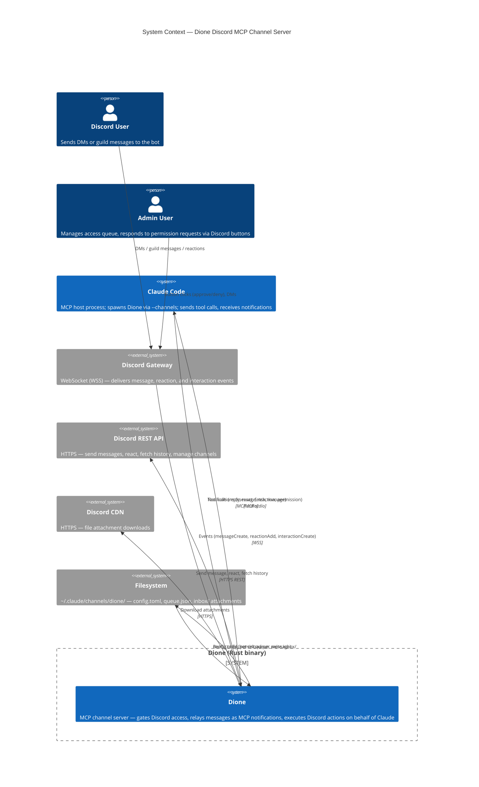
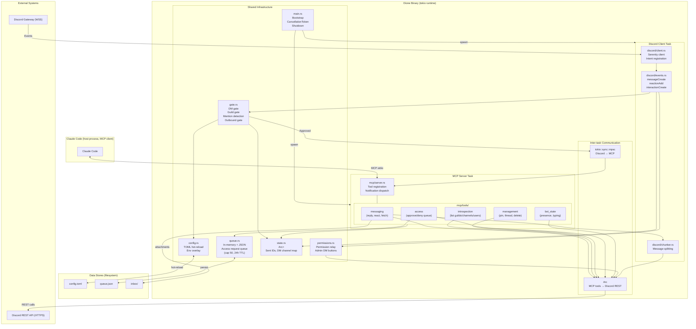
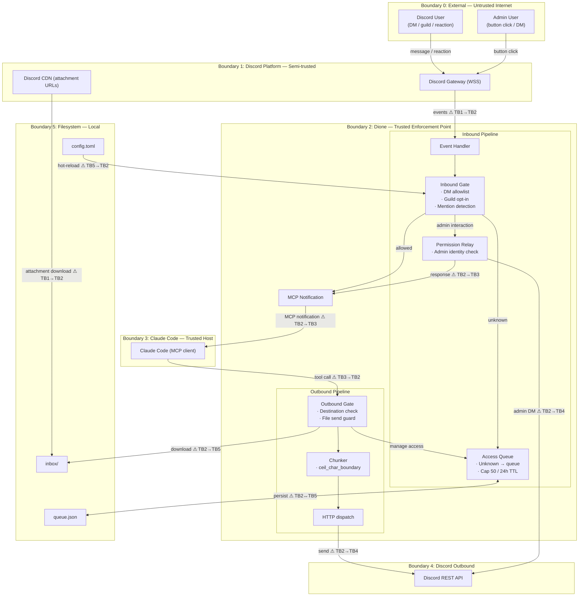
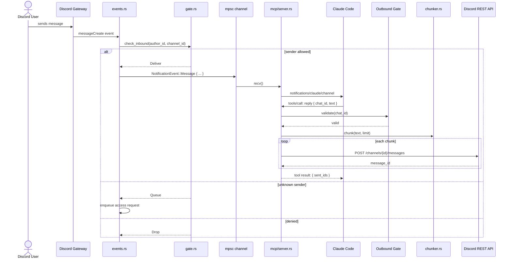
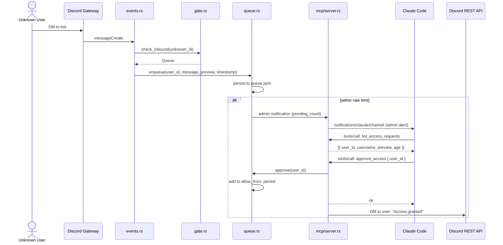
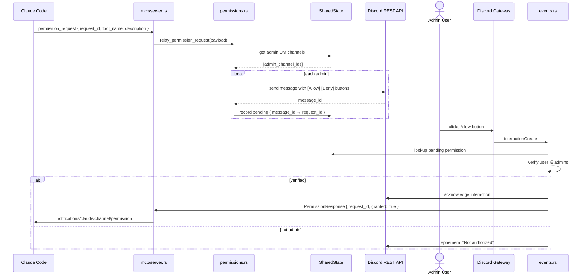

<!-- design-meta
status: draft
last-updated: 2026-05-17
phase: 3
-->

# Architecture

## Overview

Dione is a single Rust binary that acts as an MCP channel server, bridging
Discord to Claude Code. It is spawned by Claude Code via `--channels` and
communicates over MCP stdio transport. Discord connectivity is handled by
serenity (gateway + REST). The two long-lived tasks — MCP server and Discord
client — run concurrently on one tokio runtime.

## Key Decisions

### 1. Runtime topology

Two tasks on one tokio runtime:

- **MCP server task** — owns stdin/stdout, handles tool calls, dispatches
  notifications. This is the "main" task since Claude Code spawns and
  communicates with it.
- **Discord client task** — holds the gateway WebSocket, receives events,
  runs the gate check, and forwards approved events to the MCP task.

### 2. Inter-task communication

- **Inbound (Discord → MCP):** `tokio::sync::mpsc` channel from the event
  handler to the MCP server. Events are gated before entering the channel.
- **Outbound (MCP → Discord):** Tool handlers hold `Arc<serenity::Http>` and
  make REST API calls directly. No routing through the gateway task.
- **Shared state:** `Arc<RwLock<SharedState>>` containing recent-sent-IDs
  set, DM-channel-user map, and access request queue reference.

### 3. Config hot-reload

Config is re-read from disk (`config.toml`) at the start of every inbound
gate check. The file is small (< 1KB typically), so this is cheap.
`File::try_lock()` (Rust 1.89) ensures safe concurrent access if another
process is writing. Parse errors rename the file to `.corrupt-{timestamp}`
and fall back to defaults.

### 4. Access request queue

Lives in memory, persisted to `queue.json` on mutation. Loaded on startup.
Bounded: 50 entries max, 24h TTL per entry. Approval is a tool call from
Claude (`approve_access`), which adds the user to `allow_from` in the config
TOML and sends a confirmation DM.

### 5. Permission relay

Permission requests from Claude Code arrive as MCP notifications. Dione
formats them as Discord messages with Allow/Deny buttons and sends them to
admin DMs only (not all allowlisted users). Admin button clicks route back
through the gateway as `interactionCreate` events, are validated against
the admins list, and forwarded as MCP permission response notifications.

### 6. Shutdown coordination

`tokio_util::sync::CancellationToken` triggers on:
- stdin EOF (Claude Code closed the connection)
- SIGTERM / SIGINT

Shutdown sequence: cancel token fires → Discord client destroys gateway →
MCP server drains pending tool responses → process exits within 2s timeout.

### 7. Gateway intents

```rust
GatewayIntents::DIRECT_MESSAGES
| GatewayIntents::GUILDS
| GatewayIntents::GUILD_MESSAGES
| GatewayIntents::MESSAGE_CONTENT  // privileged — must be enabled in dev portal
| GatewayIntents::GUILD_MESSAGE_REACTIONS
| GatewayIntents::GUILD_VOICE_STATES  // for future voice channel support
```

### 8. Dependency choices

| Crate | Purpose | Notes |
|-------|---------|-------|
| `serenity` | Discord gateway + REST | Latest, raw event handlers (not poise) |
| `rmcp` | MCP server | Official Rust SDK, stdio transport |
| `tokio` | Async runtime | Full features |
| `tokio-util` | CancellationToken | Shutdown coordination |
| `serde` + `toml` | Config deserialization | |
| `serde_json` | Queue persistence, MCP payloads | |
| `tracing` + `tracing-subscriber` | Structured logging | env-filter |
| `thiserror` | Domain error types | |
| `color-eyre` | Rich panic reports in main | |
| `regex` | Mention pattern matching | |
| `chrono` | Timestamps | Minimal features (clock, serde) |
| `camino` | UTF-8 path types | |

Not used: `async-trait` (native async traits are available at the MSRV), `anyhow` (color-eyre
at boundaries, thiserror for domain).

### 9. Modern Rust features leveraged (1.89–1.93)

| Feature | Use |
|---------|-----|
| `str::ceil_char_boundary` (1.91) | Message chunking at valid UTF-8 split points |
| `BTreeMap::extract_if` (1.91) | Pruning expired access requests |
| `VecDeque::pop_front_if` (1.93) | Queue management |
| `File::try_lock()` (1.89) | Safe concurrent config reads |
| `Result::flatten()` (1.89) | API call chains |
| `fmt::from_fn` (1.93) | Custom formatters for Discord rendering |
| Native async traits (1.75+) | No `async-trait` crate needed |

Features stabilized after Rust 1.93 require an explicit MSRV change before use.

## Module Structure

```
src/
  main.rs              — tokio bootstrap, spawn tasks, shutdown coordination
  config.rs            — Config struct, TOML deserialization, env overlay, hot-reload
  gate.rs              — InboundGate, OutboundGate, MentionDetector
  state.rs             — SharedState, RecentSentIds, DmChannelMap
  queue.rs             — AccessQueue (in-memory + JSON persistence)
  permissions.rs       — PermissionRelay (format requests, route to admins, handle responses)

  mcp/
    mod.rs             — re-exports
    server.rs          — MCP server setup, tool registration, notification dispatch
    tools/
      mod.rs           — tool registry
      messaging.rs     — reply, react, edit_message, fetch_messages, download_attachment, get_message
      introspection.rs — list_guilds, list_channels, get_channel, get_user, get_member, list_roles
      management.rs    — pin_message, unpin_message, create_thread, delete_message
      access.rs        — list_access_requests, approve_access, deny_access
      bot_state.rs     — set_presence, send_typing

  discord/
    mod.rs             — re-exports
    client.rs          — serenity Client setup, intent registration
    events.rs          — EventHandler impl: message_create, reaction_add, interaction_create
    chunker.rs         — chunk() using str::ceil_char_boundary
```

## Diagrams

### System Context

Dione sits between two fundamentally different trust domains: Discord
(untrusted public users) and the local agent harness (trusted local process).
Claude Code consumes server-initiated MCP notifications directly. Codex mode
persists structured events to `codex-inbox.json`; the live worker leases up to
128 pending events from the highest-priority compatible lane as one durable
batch, connects to the app-server Unix socket using WebSocket, and resumes one
explicit thread. It derives active-turn state once from the resume receipt,
then maintains it from `turn/start` responses and lifecycle notifications
instead of rereading the full thread history before each delivery. The worker
uses `turn/start` or `turn/steer` and removes the whole batch atomically only
after app-server accepts delivery. Batch membership and the app-server client
message ID survive lease expiry and restart, so retries preserve order and
idempotent identity without absorbing later arrivals. Explicit MCP pull
consumers remain available, leases expire for redelivery, and a lifetime
filesystem lock enforces one Dione owner per Codex state directory.



### Component Diagram

The two long-lived tasks communicate exclusively through well-typed channels
and shared state. The mpsc channel is strictly one-directional (Discord → MCP),
while outbound actions use `Arc<Http>` directly from tool handlers.



### Data Flow with Trust Boundaries

Each boundary crossing is a potential attack surface. Boundary 1 (Discord →
Dione) is where untrusted user input must be sanitized and gated. Boundary 3
(Claude Code → Dione) is where tool call arguments must be validated against
the outbound gate before any Discord action is taken.



### Sequence: Inbound Message Flow

The gate check runs synchronously in the event handler before any data crosses
into the MCP layer. The outbound gate on the reply path is a second independent
enforcement point.



### Sequence: Access Request Flow

Unknown senders are queued rather than dropped. Admin notification is
rate-limited. Approval happens via MCP tool call, keeping the workflow
inside Claude Code.



### Sequence: Permission Relay

Permission relay originates from Claude Code sending a notification *to* Dione
(reversed direction). Dione formats it as Discord buttons for admins. The
admin's button click returns through the gateway.



## Data Stores

| Store | Location | Format | Purpose |
|-------|----------|--------|---------|
| `config.toml` | `$DIONE_STATE_DIR/config.toml` | TOML | Access policy, delivery config, admin list |
| `queue.json` | `$DIONE_STATE_DIR/queue.json` | JSON | Pending access requests (survives restart) |
| `inbox/` | `$DIONE_STATE_DIR/inbox/` | Binary files | Downloaded attachments |

Default `$DIONE_STATE_DIR`: `~/.claude/channels/dione/`

## Error Handling Strategy

| Layer | Approach |
|-------|----------|
| `main.rs` | `color_eyre::install()`, catch-all for setup errors |
| Discord events | Log + continue. Never panic on API errors. |
| MCP tool calls | Return `isError: true` with message. Never panic. |
| Config parse | Rename corrupt file, fall back to defaults, log at error level |
| Queue persistence | Best-effort write; in-memory state is authoritative |
| Shutdown | 2s timeout; force-exit if tasks don't terminate |
## GAIE Atom 1b backfill architecture

The one-shot archive path gains a discovery phase before its existing message
producer:

1. Build a typed capture root from the configured corpus, guild, and parent.
2. Collect active snapshot A, paginate public/private archives according to
   route-specific cursor rules, and collect active snapshot B.
3. Validate every candidate's guild, parent, and thread type and construct an
   opaque verified capture target. No raw child ID crosses into message fetch.
4. Union and deduplicate targets, then sort parent first and thread snowflakes
   numerically.
5. Load or migrate checkpoint v2 and fetch each stream from its independent
   cursor. New streams begin with a nullable cursor.
6. Sort messages numerically, deduplicate by Discord-global message ID, append
   and fsync each message batch, then advance only the source stream cursor.

Discovery precedes archive mutation in default mode. This keeps an incomplete
enumeration from producing an archive that appears complete. The two active
snapshots bound—but cannot eliminate—the Discord race, so coverage receipts
must say principal-visible and non-atomic.
