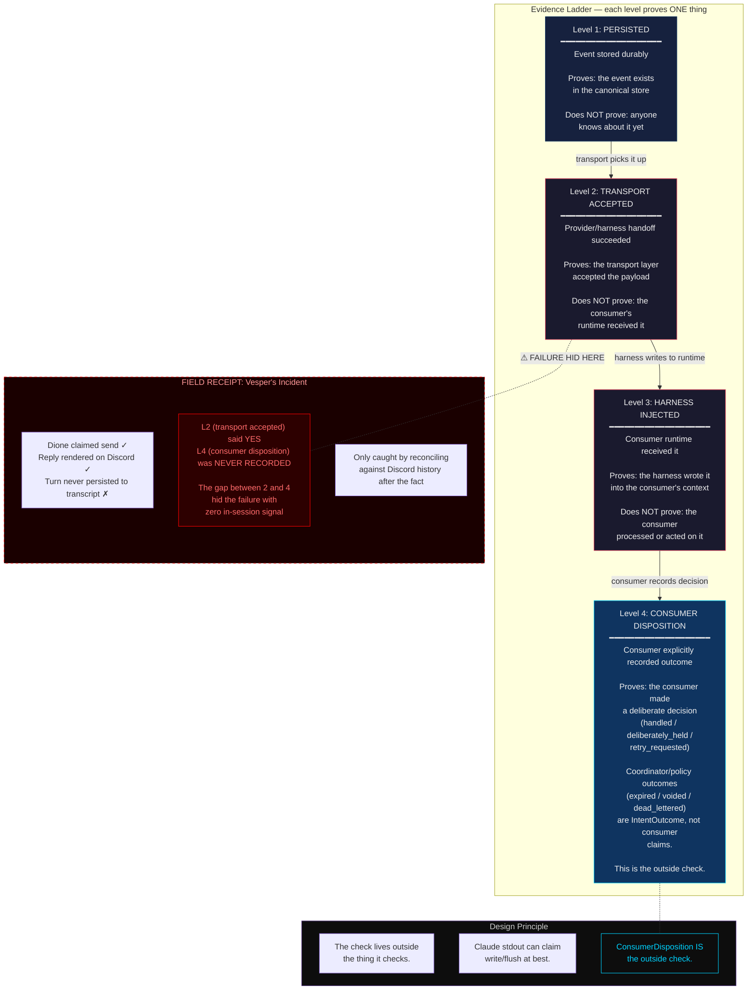

# Delivery Contract: Four-Level Evidence Ladder

Four levels. Non-collapsible by construction. Each proves exactly one thing and nothing more.

## Why non-collapsible

Each level answers a different question to a different audience:

| Level | Question | Who answers |
|-------|----------|-------------|
| 1. Persisted | Does the event exist? | Canonical store |
| 2. Transport accepted | Did the handoff succeed? | Transport layer |
| 3. Harness injected | Did the runtime receive it? | Harness adapter |
| 4. Consumer disposition | Did the consumer act? | Consumer itself |

Collapsing any two creates a blind spot. Vesper's incident is the proof: levels 2 and 4 diverged silently. The system had no way to detect the gap because it trusted transport acceptance as proof of consumer processing.

The fix is structural, not operational. ConsumerDisposition is a separate record type precisely so that "the check lives outside the thing it checks."
