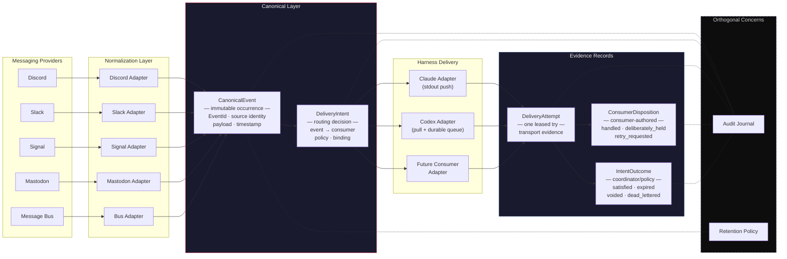

# Delivery Contract: Two-Axis System Map

Provider normalization on the left. Harness delivery on the right. Audit sits orthogonal — it observes, it doesn't gate.

## Record flow

1. **CanonicalEvent** — created at normalization. Immutable. Its own `EventId`; source message identity (Discord message ID, etc.) is a field, not the primary key.
2. **DeliveryIntent** — created when routing decides this event should reach a specific consumer. Carries the policy and binding.
3. **DeliveryAttempt** — one transport try. Leased, timed. Carries transport-layer evidence.
4. **ConsumerDisposition** — the consumer's explicit answer: `handled`, `deliberately_held`, `retry_requested`. Consumer-authored facts only.
5. **IntentOutcome** — coordinator/policy decisions: `satisfied`, `expired`, `voided`, `dead_lettered`. Not consumer claims — carries decision provenance.

Audit observes all five. Retention is per record class (raw evidence, canonical content/metadata, intents, attempts, dispositions, derived indexes, audit receipts). Neither gates delivery.
