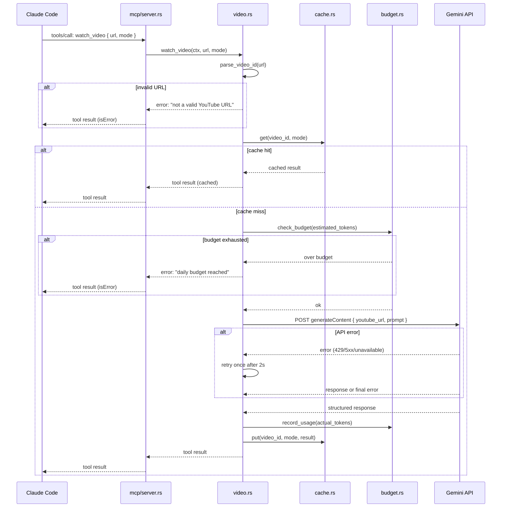

<!-- design-meta
status: draft
last-updated: 2026-05-25
depth: lightweight
-->

# Design: YouTube Video Tool (dione #40)

## Problem Space (abbreviated)

People share YouTube links in Discord constantly. Right now the bot can see the
URL but has zero understanding of video content -- it can't summarize, discuss,
or answer questions about what's in the video. McLeod specifically asked about
this capability.

**What Gemini provides natively:** The Gemini API accepts YouTube URLs directly
as input content. No download pipeline, no yt-dlp, no media processing. Gemini
handles transcript extraction, visual understanding, timestamped Q&A, and
summarization. Supports up to 1hr at default resolution, 3hr at low resolution.
Cost is ~300 input tokens/sec of video.

## Key Requirements

### Tool interface

Single MCP tool: `watch_video(url, mode)`

| Parameter | Type | Required | Description |
|-----------|------|----------|-------------|
| `url` | string | yes | YouTube video URL (various formats accepted) |
| `mode` | string | no | `summary` (default) or `discuss` |
| `channel_id` | string | yes | Requesting channel (for cost attribution) |

**Modes:**
- **summary** -- Gemini produces a structured summary (title, key points,
  timestamps). Returned as a compact tool result. Low token cost to the Claude
  context window (~500-1000 tokens).
- **discuss** -- Gemini produces detailed scene-by-scene analysis, transcript
  excerpts, and visual descriptions. Returned in full for conversational use.
  Higher cost (~2000-5000 tokens in Claude's context).

### Caching

Don't re-process the same video twice. Cache key: `(video_id, mode)`.

- Check cache before calling Gemini.
- On cache hit: return stored result immediately.
- On cache miss: call Gemini, store result, return.
- Cache storage: local JSON files in `$DIONE_STATE_DIR/video_cache/`. One file
  per video ID, containing both mode results if available. memory-mcp
  `content:video` scope is a future enhancement for cross-session semantic
  search -- out of scope for v1.
- TTL: 30 days (video content doesn't change, but metadata/availability can).

### Cost management

| Video length | Est. input tokens | Flash cost | Pro cost |
|-------------|-------------------|------------|----------|
| 5 min | ~90K | ~$0.007 | ~$0.11 |
| 30 min | ~540K | ~$0.04 | ~$0.68 |
| 1 hr | ~1.08M | ~$0.08 | ~$1.35 |

**Budget strategy (v1):** Global daily token budget configured in `config.toml`.
Default: 2M input tokens/day (covers ~20 min of video on Flash). Budget resets
at midnight UTC. When exhausted, tool returns a friendly error.

**Model tier:** Flash by default (fast, cheap, good enough for summaries). Config
option to allow Pro for `discuss` mode on videos under 15 min where deeper
understanding matters. Operator can override in config.

### Error handling

| Condition | Behavior |
|-----------|----------|
| Invalid/unparseable URL | Return error: "not a valid YouTube URL" |
| Private/unavailable video | Return Gemini's error message (it detects this) |
| Video too long (>1hr default, >3hr low-res) | Return error with duration estimate |
| Gemini API failure (rate limit, 5xx) | Retry once after 2s, then return error |
| Budget exhausted | Return error: "daily video budget reached, resets at midnight UTC" |
| Missing API key | Return error: "Gemini API key not configured" |

### Rate limiting

Serialize video requests (one at a time, no parallel Gemini calls). Respect 429s
with one retry + backoff. No complex client-side limiting -- Gemini's per-minute
limits are generous enough for a small Discord group.

## Architecture

### New modules

```
src/
  mcp/tools/
    video.rs         -- watch_video handler, URL parsing, response formatting
  video/
    mod.rs           -- re-exports
    gemini.rs        -- Gemini API client (HTTP via reqwest)
    cache.rs         -- video cache (read/write JSON, TTL pruning)
    budget.rs        -- daily token budget tracking
```

### Integration with existing infrastructure

- **Tool registration:** Add `watch_video` to `protocol.rs` tool list and
  `dispatch.rs` match arm. Follows the same `XxxCtx` pattern as other tool
  categories.
- **Config:** New `[video]` section in `config.toml` with `gemini_api_key_env`,
  `daily_token_budget`, `default_model`, `pro_threshold_minutes`.
- **HTTP client:** Reuse the existing `reqwest` dependency. Gemini REST API is
  straightforward -- no SDK needed.
- **State directory:** Cache lives under `$DIONE_STATE_DIR/video_cache/`.

### VideoCtx

```rust
pub struct VideoCtx {
    pub config: Arc<LoadedConfig>,
    pub state_dir: Utf8PathBuf,
    // reqwest client could be shared or created per-call (low volume)
}
```

### Sequence diagram



### Gemini API call

`POST .../models/{model}:generateContent` with a `fileData` part pointing at the
YouTube URL and a `text` part containing the mode-specific prompt. Summary prompt
asks for title/duration/key-points/TLDR; discuss prompt asks for scene-by-scene
breakdown, quotes, visual descriptions, and themes.

## Out of Scope

- **API key management** -- key read from env var named in config; not solved here.
- **Video download/processing** -- Gemini handles natively via URL.
- **Live stream support** -- unsupported by Gemini.
- **memory-mcp `content:video` integration** -- future semantic search enhancement.
- **Per-user/per-guild budgets** -- v1 uses global daily budget only.
- **Auto video detection** -- v1 is explicit tool-call only.

## Test Plan

- [ ] URL parsing: standard watch URLs, short URLs (youtu.be), playlist URLs,
      timestamps, mobile URLs, invalid strings
- [ ] Cache hit returns stored result without Gemini call
- [ ] Cache miss calls Gemini and stores result
- [ ] Cache TTL: expired entries are not returned
- [ ] Budget tracking: requests rejected when daily budget exhausted
- [ ] Budget resets at midnight UTC
- [ ] Gemini error handling: 429 retry, 5xx retry, private video error
- [ ] Mode selection: summary produces compact output, discuss produces detailed
- [ ] Config: missing API key returns clear error
- [ ] Config: model tier selection (flash default, pro when configured)
- [ ] Integration: tool appears in tools/list, dispatch routes correctly
- [ ] Snapshot tests for formatted tool output (insta)
